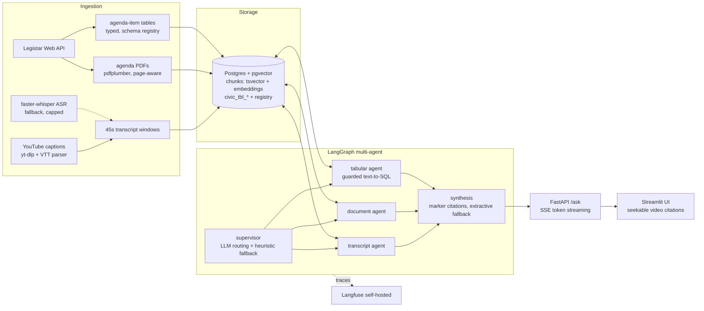
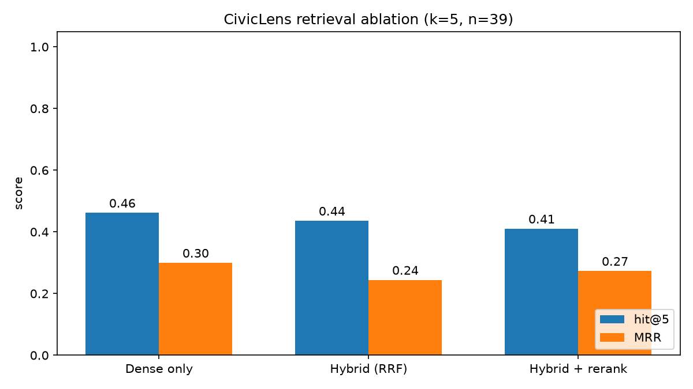

# CivicLens 🏛️

[](https://github.com/Nile6335/civiclens/actions/workflows/ci.yml)
[](LICENSE)
[](pyproject.toml)

**Ask questions about your city council's meetings — get answers that cite the exact
video timestamp, agenda page, or data table they came from.**

City-council decisions are public record, but the record is hostile: hours of video,
hundred-page agenda packets, and budget tables scattered across portals. CivicLens
ingests all three modalities from real municipal sources (the Legistar Web API +
official YouTube channels), indexes them for hybrid retrieval, and answers questions
through a multi-agent pipeline that refuses to make claims it cannot cite.

Everything runs locally: **zero paid services, zero API keys, CPU-only.**
Built and evaluated on real meetings of the Mesa (AZ) and Seattle city councils.

## Quickstart

```bash
make setup   # python deps + docker stack (pgvector, langfuse) + local LLM via ollama
make demo    # ingest the bundled sample meeting, launch API + UI, open the browser
```

Requires Docker, ~4-5GB free disk, and 8GB RAM (lean profile; macOS/Linux — on
Windows use WSL2). First
`make setup` downloads ~2.5GB (python deps, two small docker images, a 1GB local LLM,
~150MB of embedding models) — expect 10-20 minutes. `make ingest-live` pulls fresh
meetings from Legistar/YouTube. An `ANTHROPIC_API_KEY` + `LLM_BACKEND=anthropic`
upgrades the synthesis/judge model — nothing else changes.

## Architecture



**Retrieval**: dense (pgvector cosine over sentence-transformers embeddings) + Postgres
full-text search, fused with Reciprocal Rank Fusion, then cross-encoder reranking;
filters on city / source type / topic / date. **Citations are deterministic**: the
synthesis LLM emits evidence markers (`[E1]`) that are resolved to
`[video @ mm:ss](url&t=Ns)` / `[doc, p.N]` / `[table: name]` in post-processing —
a well-formed citation never depends on the model reproducing a URL. Uncited answers
fall back to extractive quotes; no evidence yields *"Not found in the record."*

**Tabular guardrails** (all layers active at once): SELECT/WITH-only validation with a
forbidden-keyword list, table allowlist from the schema registry, forced row-limit
wrapper, a SELECT-only Postgres role, and a 3s statement timeout.

**Voice mode** (`/voice-demo`): push-to-talk → streaming `faster-whisper` transcription
→ the same agent pipeline → sentence-level Piper TTS streamed back over a WebSocket, so
spoken playback begins before the full answer is generated. **PII redaction** runs at
ingest over transcript text, and a **prompt-injection red-team** measures attack success
before and after mitigations. Both are detailed below and gated in CI.

## Evaluation (the interesting part)

A synthetic-but-validated golden dataset over the real corpus:

- **133 candidate Q&A pairs generated** from transcript/PDF chunks (LLM) and the
  normalized tables (programmatic — correct by construction), with exact supporting
  spans recorded by natural key so re-ingestion doesn't orphan them.
- **Validation pass**: programmatic span-support verification plus LLM judging of
  ambiguity and triviality (three separate binary checks — a small local judge fails
  multi-criteria rubrics, which we measured rather than assumed). **37% of LLM-generated
  pairs survived**, leaving **67 validated items** (39 span-backed + 28 table).
- **Relevance is answer-bearing** (the open-domain-QA convention): a retrieved chunk
  counts if it is the gold span, a window neighbour, or contains the answer — councils
  repeat names across a meeting and agendas restate the transcript.

### Retrieval ablation (measured on this corpus, k=5, n=39 span-backed questions)



| mode | hit@5 | MRR |
|---|---|---|
| Dense only (bge-small-en-v1.5) | **0.462** | **0.300** |
| Hybrid (RRF dense+keyword) | 0.436 | 0.244 |
| Hybrid + rerank (TinyBERT cross-encoder) | 0.410 | 0.273 |

The honest finding: **on this small corpus, strong dense embeddings win top-5 outright**;
naive RRF fusion with a relaxed keyword fallback dilutes the candidate pool on long
questions, and a 4MB reranker recovers most (not all) of the ordering loss within the
pool (MRR 0.244 → 0.273). Hybrid's value shows on short keyword-style queries
("consent agenda") — covered by the sanity tests — rather than on long generated
questions. With the spec-scale profile (bge-m3 + bge-reranker-base) the ordering may
flip; the harness makes re-measuring a one-liner.

RAGAS over 24 end-to-end pipeline answers (local 1.5B judge): **context recall 0.823,
context precision 0.737**, answer relevancy 0.521, faithfulness 0.292. Retrieval feeds
the right evidence; the faithfulness number is a lower bound — the judge is the same
small model whose statement-support verdicts we measured to be unreliable on spoken
text (see [docs/DECISIONS.md](docs/DECISIONS.md)), while the answers themselves are marker-cited and largely
extractive by construction. Current numbers: `evals/results/results.json`.

**CI regression gate**: every push re-runs the eval on the bundled sample corpus
(real Ollama in the runner) and fails the build if faithfulness or MRR regresses >5%
against the committed per-configuration baseline. Floors are metric-aware: MRR is
deterministic and gated strictly; LLM-judged faithfulness carries an absolute noise
grace so judge variance at small n doesn't produce false failures.

Reproduce everything: `make eval` (ablation + RAGAS), `python -m evals.generate` +
`python -m evals.validate` to rebuild the dataset.

## Stack

Python 3.11 · uv · Postgres 16 + pgvector (HNSW) · LangGraph · Ollama (qwen2.5:1.5b
lean / llama3.1:8b spec) · sentence-transformers (bge-small lean / bge-m3 spec) ·
RAGAS · faster-whisper · Piper TTS · dslim/bert-base-NER · FastAPI + SSE + WebSocket ·
Streamlit · Langfuse v2 · Docker Compose · GitHub Actions

Every model knob is env-switchable (`.env.example` documents the lean profile the
project was built on — an 8GB M2 with <5GB free disk — and the spec-scale profile).

## Cost & latency notes

- **Ollama backend (default)**: $0. On an M2 (Metal), qwen2.5:1.5b generates at
  ~90-130 tok/s; an end-to-end `/ask` (routing + retrieval + rerank + synthesis) lands
  in roughly 8-15s, dominated by LLM calls. Embedding backfill: ~600 chunks/min CPU.
- **Anthropic backend (optional)**: flips synthesis/judging to `claude-sonnet-4-6`;
  at typical usage (~2k input + 300 output tokens per ask) that is roughly a cent per
  question — and it materially improves synthesis, routing, and judge quality.

## Real-time voice mode

Ask by speaking, hear a spoken cited answer. The pipeline (`/voice-demo`, served by
FastAPI) is: browser mic → WebSocket → streaming `faster-whisper` (small, int8) →
the existing LangGraph agents → sentence-level **Piper TTS** (`en_US-lessac-medium`,
ungated, CPU) streamed back frame-by-frame so playback starts before the answer
finishes. Optimizations: sentence-level TTS pipelining, eager keyword routing in voice
mode (skips the serial LLM router round-trip), and startup model warm-up.

Engineered against a stated budget (time-to-first-audio < 3s on CPU) and **measured
honestly** — every turn logs ASR-finalization, time-to-first-token, time-to-first-audio,
and total turn time to `evals/results/voice_latency.json`:

| metric | p50 | p95 |
|---|---|---|
| ASR finalization | 30.1s | 50.2s |
| time-to-first-token | 25.8s | 38.9s |
| time-to-first-audio | 37.9s | 61.4s |
| total turn | 41.7s | 61.4s |

The 3s target is **not met on an 8GB CPU box** — whisper `small` and local-LLM synthesis
dominate — and that honesty is the point: the instrumentation, the CPU loopback test
(Piper synthesizes the question, whisper transcribes it, the agents answer, Piper speaks
the reply — no human speech, runs in CI), and the optimization levers are the
deliverable. On the Anthropic backend and/or GPU whisper these numbers drop sharply; the
CPU figures are the floor.

**Platform note (TTS):** the spoken-audio half depends on Piper, whose prebuilt wheel
bundles a native espeak-ng. On Linux (incl. CI) and most builds this works out of the
box; some macOS arm64 prebuilt wheels ship a broken espeak build. CivicLens **probes TTS
once in a subprocess** — if synthesis would crash, it is never run in-process (a native
`abort()` there would take down the server), and the voice turn **degrades cleanly to a
text answer** with an explicit "audio unavailable" signal to the UI. So transcription
and the cited answer always work; audio playback works wherever Piper's native build is
sound (and `brew install espeak-ng` can enable it on affected Macs). Text `/ask` is
unaffected either way.

## Security & privacy

Two safety subsystems, both measured and CI-gated (`make redteam`):

**PII redaction** — residents recite home addresses, phones, and emails during public
comment, straight into the transcript. Redaction runs at ingest over transcript text
(only), replacing spans with typed placeholders and quarantining the originals in a
table the read-only tabular role cannot read. Measured on a seeded test set (known PII
injected into real transcript text), **recall-first by design**:

| type | precision | recall |
|---|---|---|
| phone | 1.00 | 1.00 |
| email | 1.00 | 1.00 |
| address | 1.00 | 1.00 |
| person (NER) | 0.74 | 1.00 |

A deliberate scope decision: only the regex types (phone/email/address) are redacted from
the live record. Person-name NER is built and measured (catches every injected name at
0.74 precision — the recall-first tradeoff) but **not applied wholesale**, because council
meetings are full of public officials whose names *are* the record; blanket
name-redaction would gut the product. On the bundled sample, a real address a speaker
stated ("1526 East Main Street") is redacted to `[ADDRESS]` while the council member
"GoForth" is correctly retained.

**Prompt-injection red team** — a ~30-attack corpus across four classes (document-embedded
instructions, tabular SQL abuse, citation spoofing, system-prompt extraction), scored by
Attack Success Rate with mitigations off vs on:

| | before | after |
|---|---|---|
| overall ASR | 0.033 | **0.00** |
| document-injection | 0.125 | 0.00 |
| SQL abuse / citation-spoof / prompt-extraction | 0.00 | 0.00 |

The finding is architectural: most classes were already at zero because the design blocks
them structurally — SQL abuse by the layered guardrails, citation spoofing by deterministic
citation resolution (the model emits markers, not URLs), prompt extraction because there is
no standing secret prompt. The prompt-level mitigations (untrusted-content demarcation,
instruction-hierarchy preamble, embedded-instruction sanitization, output validation) close
the remaining document-injection gap to zero. (Scoring correctness mattered: a `UNION` over
two allowlisted tables is not a breach — the table allowlist already prevents it reaching
`users`/`pg_shadow` — so the scorer counts a UNION as exfiltration only when it references a
table outside the `civic_tbl_` allowlist.)

## Honest limitations

- The corpus is 7 meetings across 2 cities (~600 chunks) — retrieval numbers on a
  corpus this small have wide error bars, and hit@5 penalizes near-miss chunks even
  with answer-bearing expansion.
- Voice latency is tens of seconds on CPU (see the table above); real-time feel needs a
  GPU whisper or the Anthropic backend. The red-team corpus is ~30 attacks — a
  demonstration of before/after measurement, not an exhaustive audit.
- qwen2.5:1.5b is a weak judge: RAGAS scores and the dataset acceptance rate carry
  real noise at this scale (we measured its failure modes — see
  [docs/DECISIONS.md](docs/DECISIONS.md) — and moved span-verification to a
  programmatic check because of them).
- PDF ingestion is text-first (pdfplumber); image-only PDFs need the optional OCR path
  (pytesseract), and complex table layouts inside PDFs are extracted best-effort.
- Topic tags default to a keyword tagger; the zero-shot classifier
  (`TOPIC_TAGGER=zeroshot`) is implemented but off by default (1.6GB model).
- One meeting was ingested twice from two Legistar events pointing at the same video —
  deduplication by video id is future work.

## Repo layout

```
ingestion/   VTT/ASR/PDF/table pipelines, Legistar client, CLI (samples|live)
retrieval/   embeddings, hybrid search (RRF + rerank), topic tagging, indexer
agents/      LangGraph graph, evidence/citations, guarded text-to-SQL
voice/       streaming ASR, Piper TTS, latency instrumentation
safety/      PII redaction + quarantine, prompt-injection red team, mitigations
evals/       golden dataset gen + validation, metrics, ablation, RAGAS, CI gate
api/         FastAPI /ask (SSE), /examples, /health
ui/          Streamlit app (seekable video citations, evidence panel)
infra/       docker-compose, migrations, Dockerfile, demo scripts
data/samples bundled real sample corpus (provenance in its README)
```

Design decisions and measured engineering findings: [docs/DECISIONS.md](docs/DECISIONS.md).

## License

[MIT](LICENSE). The bundled sample corpus is public government record published by the
City of Mesa via Legistar/Granicus and YouTube (provenance in
[data/samples/README.md](data/samples/README.md)).
